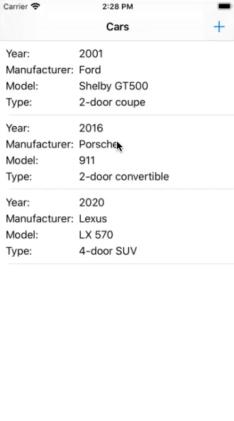
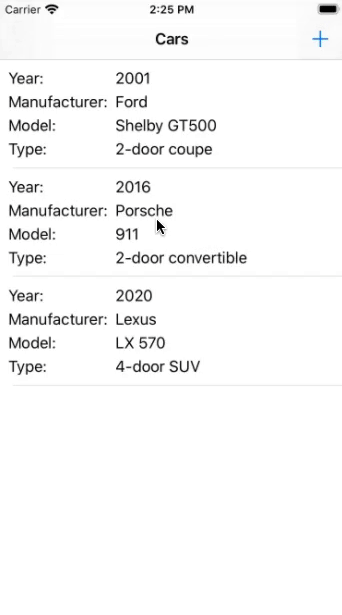
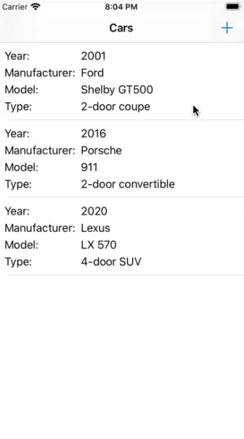

# CarCatalog
Приложение для учёта автомобилей, написанное на языке *Swift* с применением паттерна **MVVM**.
Для создания локальной базы данных применяется фреймворк **CoreData**.

## Демо

| Добавление новой записи    | Редактирование записи       | Удаление записи               |
| :-------------------------:| :--------------------------:|:-----------------------------:|
|  |  |  |
